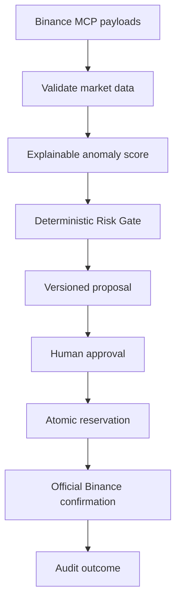

# SentinelFlow

**Explainable market surveillance. Deterministic risk controls. Human-approved execution.**

SentinelFlow is a safety-focused AI agent built for the Binance Agent OS Mini Hackathon.

It analyses market observations, explains unusual activity, applies deterministic risk policies and creates human-approved trade proposals—without giving an AI silent authority over user funds.

> **Track A submission:** SentinelFlow demonstrates controlled agent decision-making. No live trade is claimed.

## Why it matters

Binance MCP provides market and trading capabilities. SentinelFlow provides the safety layer around those capabilities:

- Was the market data valid and recent?
- Why was an event classified as unusual?
- What evidence contradicts the signal?
- Does the proposal pass account and exchange constraints?
- Did the user approve this exact proposal?
- Has it expired or already been executed?
- Can every decision be audited afterward?

> Binance MCP provides the execution capability. SentinelFlow provides the analysis, brakes and black-box recorder.

## How it works



SentinelFlow validates and analyses live market-data payloads returned by the official Binance Agentic MCP. It does not independently authenticate with Binance or bypass Binance’s supported connector and confirmation controls.

## Key features

- Explainable 0–100 anomaly scoring
- Supporting evidence and counter-evidence
- Replay and live-data analysis
- Stale and malformed snapshot rejection
- Open-candle exclusion
- Binance symbol and account constraint validation
- Deterministic Risk Gate
- Versioned human approval
- Idempotent proposal creation
- Atomic execution reservation
- Duplicate-attempt protection
- Unknown-outcome reconciliation
- Runtime secret redaction
- PostgreSQL audit timeline
- Streamlit dashboard
- FastAPI endpoints
- Two separated MCP servers
- 57 passing automated tests

## Market analysis

SentinelFlow calculates:

- Relative volume
- Volume z-score
- Price change and acceleration
- Realised volatility
- VWAP distance
- Bid/ask depth ratio
- Spread
- Quote-notional liquidity depth

The LLM may explain a completed result, but it cannot calculate or override the deterministic score.

## Safety boundaries

SentinelFlow rejects:

- Replay or paper signals presented for live execution
- Stale, future or timezone-naive timestamps
- Mismatched symbols
- Malformed klines
- Open candles
- Crossed order books
- Unapproved or expired proposals
- Previously executed proposals
- Conflicting idempotency requests

Approval inside SentinelFlow does not execute an order.

Before external execution, SentinelFlow locks and reserves the exact approved proposal. An uncertain result becomes:

```text
UNKNOWN_REQUIRES_RECONCILIATION
```

It is never treated as permission for a blind retry.

## MCP separation

SentinelFlow uses two MCP entry points to separate read-only analysis from control operations.

### Analysis server

```text
python -m app.mcp_server.analysis_server
```

Tools:

- `analyze_replay`
- `analyze_live_snapshot`

These tools cannot create, approve, reserve or execute orders.

### Proposal and control server

```text
python -m app.mcp_server.server
```

Tools cover:

- Paper and live proposal creation
- Human approval
- Approved-proposal inspection
- Execution reservation
- Result recording
- Audit history

Actual Binance authentication and execution remain with the official supported Binance connector.

## Quick start on Windows

### 1. Create the environment

```cmd
python -m venv .venv
.venv\Scripts\activate
python -m pip install --upgrade pip
pip install -e ".[dev]"
copy .env.example .env
```

Keep the safe defaults:

```env
APP_MODE=replay
LIVE_TRADING_ENABLED=false
```

### 2. Configure PostgreSQL

Create a database named `sentinelflow` or start the included Docker service:

```cmd
docker compose up -d postgres
```

Then apply migrations:

```cmd
alembic upgrade head
```

### 3. Verify the project

```cmd
pytest -q
python -m pip_audit
python scripts\smoke_test.py
```

Most recently verified:

```text
57 passed, 1 skipped
No known dependency vulnerabilities
SMOKE TEST PASSED
```

### 4. Run the API and dashboard

API:

```cmd
uvicorn app.main:app --reload
```

Open:

```text
http://127.0.0.1:8000/docs
```

Dashboard:

```cmd
streamlit run app/ui/dashboard.py
```

Open:

```text
http://localhost:8501
```

## Demo flow

1. Analyse the SOL accumulation replay and show its high anomaly score.
2. Analyse the normal BTC replay for comparison.
3. Create and risk-check a paper proposal.
4. Record human approval.
5. Attempt replay-derived execution and show it being rejected.
6. Submit stale live-shaped data and show structured rejection.
7. Analyse a valid Binance-shaped payload locally.
8. Display the audit timeline.
9. Explain that final execution remains behind Binance’s official confirmation.

## Project structure

```text
app/analytics/     Feature calculation and scoring
app/api/           FastAPI routes
app/database/      Models, repositories and sessions
app/llm/           Optional AI explanations
app/mcp_server/    Analysis and control MCP servers
app/replay/        Replay loader
app/risk/          Risk gate and state machine
app/security/      Secret redaction
app/services/      Analysis, proposals and execution
app/ui/            Streamlit dashboard
tests/             Automated tests
```

## Honest limitations

- SentinelFlow accepts Binance MCP payloads but does not fetch them independently.
- No live Spot trade is claimed.
- The complete workflow has not been demonstrated as one seamless hosted transaction.
- Replay datasets are synthetic test fixtures.
- The scoring thresholds require larger historical validation.
- Cumulative exposure is not yet reconstructed from current holdings and verified fills.
- Daily realised loss should ultimately come from verified execution history.
- Production deployment would require authentication, authorization and operational monitoring.

## Intentionally excluded

- Futures and Margin
- Withdrawals and transfers
- Fully autonomous trading
- Arbitrage
- Portfolio rebalancing
- Credential custody
- Bypassing Binance’s supported-agent controls

## Security

- Replay mode is the default.
- Live execution is disabled by default.
- `.env` is ignored by Git.
- Binance credentials are not stored.
- Sensitive runtime values are redacted.
- Human approval is separate from execution.
- Binance retains its authentication and final confirmation boundary.

## Disclaimer

SentinelFlow is a hackathon prototype. It is not financial advice, does not guarantee profitable results and should not be treated as a production trading system. Cryptocurrency trading can result in loss of capital.